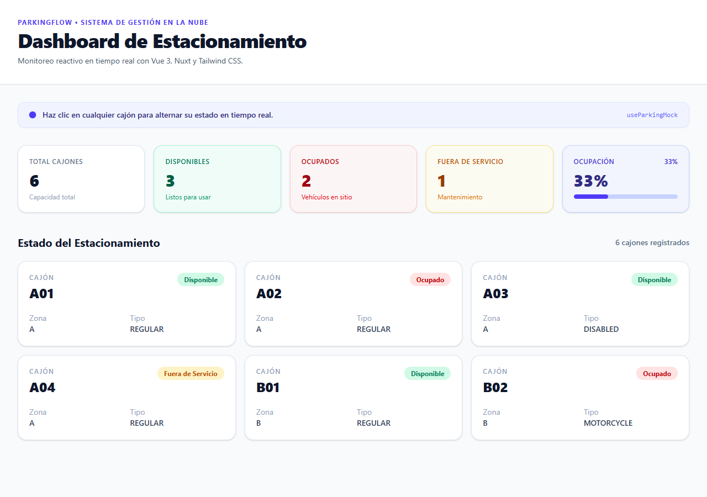

# Evidencia 1
## Clase 11 de Septiembre 2026 - Fernando Daniel Tolentino Uribe

---

### 1. Comandos de Git Ejecutados
Desde la raíz del proyecto (`ParkingFlow`), se prepararon las ramas solicitadas para el desarrollo del dashboard:
```bash
# Crear y cambiar a la rama develop
git switch -c develop

# Crear y cambiar a la rama del dashboard
git switch -c feature/dashboard
```

---

### 2. Estructura de Archivos del Frontend (`apps/web/app/`)
```
apps/web/app/
├── assets/
│   └── css/
│       └── main.css
├── components/
│   ├── parking/
│   │   ├── ParkingGrid.vue
│   │   ├── ParkingSpaceCard.vue
│   │   └── ParkingSummary.vue
│   └── ui/
│       └── BaseBadge.vue
├── composables/
│   └── useParkingMock.ts
├── pages/
│   └── index.vue
├── types/
│   └── parking.ts
└── app.vue
```

---

### 3. Código Fuente Implementado

#### `apps/web/app/types/parking.ts`
```typescript
export type ParkingSpaceStatus = 
    | 'AVAILABLE'
    | 'OCCUPIED' 
    | 'OUT_OF_SERVICE'

export type ParkingSpaceType =
    | 'REGULAR'
    | 'DISABLED'
    | 'MOTORCYCLE'

export interface ParkingSpace {
    id: string
    code: string
    zone: string
    type: ParkingSpaceType
    status: ParkingSpaceStatus
    active: boolean
}
```

#### `apps/web/app/composables/useParkingMock.ts`
```typescript
import { computed, ref } from 'vue'
import type { ParkingSpace, ParkingSpaceStatus } from '~/types/parking'

export const useParkingMock = () => {
    const spaces = ref<ParkingSpace[]>([
        { id: 'A01', code: 'A01', zone: 'A', type: 'REGULAR', status: 'AVAILABLE', active: true },
        { id: 'A02', code: 'A02', zone: 'A', type: 'REGULAR', status: 'OCCUPIED', active: true },
        { id: 'A03', code: 'A03', zone: 'A', type: 'DISABLED', status: 'AVAILABLE', active: true },
        { id: 'A04', code: 'A04', zone: 'A', type: 'REGULAR', status: 'OUT_OF_SERVICE', active: true },
        { id: 'B01', code: 'B01', zone: 'B', type: 'REGULAR', status: 'AVAILABLE', active: true },
        { id: 'B02', code: 'B02', zone: 'B', type: 'MOTORCYCLE', status: 'OCCUPIED', active: true }
    ])

    const total = computed(() => spaces.value.length)
    const available = computed(() => spaces.value.filter(item => item.status === 'AVAILABLE').length)
    const occupied = computed(() => spaces.value.filter(item => item.status === 'OCCUPIED').length)
    const outOfService = computed(() => spaces.value.filter(item => item.status === 'OUT_OF_SERVICE').length)

    const occupancyPercentage = computed(() => {
        if (total.value === 0) {
            return 0
        }
        return Math.round((occupied.value / total.value) * 100)
    })

    const updateStatus = (id: string, status: ParkingSpaceStatus) => {
        const space = spaces.value.find(item => item.id === id)
        if (space) {
            space.status = status
        }
    }

    return { spaces, total, available, occupied, outOfService, occupancyPercentage, updateStatus }
}
```

#### `apps/web/app/components/ui/BaseBadge.vue`
```html
<script setup lang="ts">
type Variant = 'success' | 'danger' | 'warning' | 'neutral'
interface Props {
  variant?: Variant
}

withDefaults(defineProps<Props>(), {
  variant: 'neutral'
})

const classes: Record<Variant, string> = {
  success: 'bg-emerald-100 text-emerald-700',
  danger: 'bg-red-100 text-red-700',
  warning: 'bg-amber-100 text-amber-700',
  neutral: 'bg-slate-100 text-slate-700'
}
</script>

<template>
  <span 
    :class="classes[variant]"
    class="inline-flex rounded-full px-3 py-1 text-xs font-bold"
  >
    <slot />
  </span>
</template>
```

#### `apps/web/app/components/parking/ParkingSpaceCard.vue`
```html
<script setup lang="ts">
import BaseBadge from '../ui/BaseBadge.vue'
import type { ParkingSpace } from '~/types/parking'

interface Props {
  space: ParkingSpace
}

defineProps<Props>()

const emit = defineEmits<{
  select: [space: ParkingSpace]
}>()

const statusData = {
  AVAILABLE: { label: 'Disponible', variant: 'success' as const },
  OCCUPIED: { label: 'Ocupado', variant: 'danger' as const },
  OUT_OF_SERVICE: { label: 'Fuera de Servicio', variant: 'warning' as const }
}
</script>

<template>
  <button
    type="button" 
    class="w-full rounded-2xl border border-slate-200 bg-white p-5 text-left shadow-sm transition hover:-translate-y-0.5 hover:shadow-md cursor-pointer"
    @click="emit('select', space)"
  >
    <div class="flex items-start justify-between gap-3">
      <div>
        <p class="text-xs font-semibold uppercase tracking-widest text-slate-400">
          Cajón
        </p>
        <p class="mt-1 text-2xl font-black text-slate-900">
          {{ space.code }}
        </p>
      </div>
      <BaseBadge :variant="statusData[space.status].variant">
        {{ statusData[space.status].label }}
      </BaseBadge>
    </div>

    <dl class="mt-5 grid grid-cols-2 gap-3 text-sm">
      <div>
        <dt class="text-slate-400">Zona</dt>
        <dd class="font-semibold text-slate-700">{{ space.zone }}</dd>
      </div>

      <div>
        <dt class="text-slate-400">Tipo</dt>
        <dd class="font-semibold text-slate-700">{{ space.type }}</dd>
      </div>
    </dl>
  </button>
</template>
```

#### `apps/web/app/components/parking/ParkingGrid.vue`
```html
<script setup lang="ts">
import type { ParkingSpace } from '~/types/parking'
import ParkingSpaceCard from './ParkingSpaceCard.vue'

interface Props {
  spaces: ParkingSpace[]
}

defineProps<Props>()

const emit = defineEmits<{
  select: [space: ParkingSpace]
}>()
</script>

<template>
  <section>
    <div class="mb-5 flex items-center justify-between">
      <h2 class="text-xl font-bold text-slate-900">
        Estado del Estacionamiento
      </h2>
      <span class="text-sm font-medium text-slate-500">
        {{ spaces.length }} cajones registrados
      </span>
    </div>

    <div class="grid gap-4 sm:grid-cols-2 lg:grid-cols-3">
      <ParkingSpaceCard 
        v-for="space in spaces"
        :key="space.id"
        :space="space"
        @select="emit('select', $event)"
      />
    </div>
  </section>
</template>
```

#### `apps/web/app/components/parking/ParkingSummary.vue`
```html
<script setup lang="ts">
interface Props {
  total?: number
  available?: number
  occupied?: number
  outOfService?: number
  occupancyPercentage?: number
}

withDefaults(defineProps<Props>(), {
  total: 0,
  available: 0,
  occupied: 0,
  outOfService: 0,
  occupancyPercentage: 0
})
</script>

<template>
  <section class="grid gap-4 sm:grid-cols-2 lg:grid-cols-5">
    <!-- Total Cajones -->
    <div class="rounded-2xl border border-slate-200 bg-white p-5 shadow-sm">
      <p class="text-xs font-semibold uppercase tracking-wider text-slate-500">
        Total Cajones
      </p>
      <p class="mt-2 text-3xl font-black text-slate-900">
        {{ total }}
      </p>
      <p class="mt-1 text-xs text-slate-400">Capacidad total</p>
    </div>

    <!-- Disponibles -->
    <div class="rounded-2xl border border-emerald-200 bg-emerald-50/60 p-5 shadow-sm">
      <p class="text-xs font-semibold uppercase tracking-wider text-emerald-700">
        Disponibles
      </p>
      <p class="mt-2 text-3xl font-black text-emerald-800">
        {{ available }}
      </p>
      <p class="mt-1 text-xs text-emerald-600">Listos para usar</p>
    </div>

    <!-- Ocupados -->
    <div class="rounded-2xl border border-red-200 bg-red-50/60 p-5 shadow-sm">
      <p class="text-xs font-semibold uppercase tracking-wider text-red-700">
        Ocupados
      </p>
      <p class="mt-2 text-3xl font-black text-red-800">
        {{ occupied }}
      </p>
      <p class="mt-1 text-xs text-red-600">Vehículos en sitio</p>
    </div>

    <!-- Fuera de Servicio -->
    <div class="rounded-2xl border border-amber-200 bg-amber-50/60 p-5 shadow-sm">
      <p class="text-xs font-semibold uppercase tracking-wider text-amber-700">
        Fuera de Servicio
      </p>
      <p class="mt-2 text-3xl font-black text-amber-800">
        {{ outOfService }}
      </p>
      <p class="mt-1 text-xs text-amber-600">Mantenimiento</p>
    </div>

    <!-- Porcentaje de Ocupación -->
    <div class="rounded-2xl border border-indigo-200 bg-indigo-50/60 p-5 shadow-sm">
      <div class="flex items-center justify-between">
        <p class="text-xs font-semibold uppercase tracking-wider text-indigo-700">
          Ocupación
        </p>
        <span class="text-xs font-bold text-indigo-700">{{ occupancyPercentage }}%</span>
      </div>
      <p class="mt-2 text-3xl font-black text-indigo-900">
        {{ occupancyPercentage }}%
      </p>
      <div class="mt-2 h-2 w-full overflow-hidden rounded-full bg-indigo-200">
        <div 
          class="h-full rounded-full bg-indigo-600 transition-all duration-300"
          :style="{ width: `${occupancyPercentage}%` }"
        />
      </div>
    </div>
  </section>
</template>
```

#### `apps/web/app/pages/index.vue`
```html
<script setup lang="ts">
import { ref } from 'vue'
import { useParkingMock } from '~/composables/useParkingMock'
import ParkingSummary from '~/components/parking/ParkingSummary.vue'
import ParkingGrid from '~/components/parking/ParkingGrid.vue'
import type { ParkingSpace, ParkingSpaceStatus } from '~/types/parking'

const {
  spaces,
  total,
  available,
  occupied,
  outOfService,
  occupancyPercentage,
  updateStatus
} = useParkingMock()

const lastActionMessage = ref<string>('Haz clic en cualquier cajón para alternar su estado en tiempo real.')

const handleSelectSpace = (space: ParkingSpace) => {
  const nextStatusMap: Record<ParkingSpaceStatus, ParkingSpaceStatus> = {
    AVAILABLE: 'OCCUPIED',
    OCCUPIED: 'OUT_OF_SERVICE',
    OUT_OF_SERVICE: 'AVAILABLE'
  }
  const oldStatus = space.status
  const newStatus = nextStatusMap[space.status]
  updateStatus(space.id, newStatus)
  lastActionMessage.value = `Evento: Se cambió el estado del Cajón ${space.code} de [${oldStatus}] a [${newStatus}]`
}
</script>

<template>
  <main class="min-h-screen bg-slate-50">
    <!-- Header de la Aplicación -->
    <header class="border-b border-slate-200 bg-white shadow-xs">
      <div class="mx-auto max-w-7xl px-4 py-8 sm:px-6 lg:px-8">
        <p class="text-xs font-bold uppercase tracking-widest text-indigo-600">
          ParkingFlow &bull; Sistema de Gestión en la Nube
        </p>
        <h1 class="mt-1 text-3xl font-black tracking-tight text-slate-900 sm:text-4xl">
          Dashboard de Estacionamiento
        </h1>
        <p class="mt-2 max-w-2xl text-sm text-slate-600">
          Monitoreo reactivo en tiempo real con Vue 3, Nuxt y Tailwind CSS.
        </p>
      </div>
    </header>

    <div class="mx-auto max-w-7xl px-4 py-8 sm:px-6 lg:px-8">
      <!-- Monitor de Eventos / Acciones -->
      <div class="mb-8 flex items-center justify-between rounded-xl border border-indigo-100 bg-indigo-50/70 px-5 py-3 text-sm text-indigo-900 shadow-xs">
        <div class="flex items-center gap-3">
          <span class="relative flex h-3 w-3">
            <span class="absolute inline-flex h-full w-full animate-ping rounded-full bg-indigo-400 opacity-75" />
            <span class="relative inline-flex h-3 w-3 rounded-full bg-indigo-600" />
          </span>
          <span class="font-medium">{{ lastActionMessage }}</span>
        </div>
        <span class="hidden font-mono text-xs text-indigo-500 sm:inline-block">
          useParkingMock
        </span>
      </div>

      <!-- Resumen Métrico -->
      <div class="mb-10">
        <ParkingSummary
          :total="total"
          :available="available"
          :occupied="occupied"
          :out-of-service="outOfService"
          :occupancy-percentage="occupancyPercentage"
        />
      </div>

      <!-- Cuadrícula de Cajones -->
      <ParkingGrid
        :spaces="spaces"
        @select="handleSelectSpace"
      />
    </div>
  </main>
</template>
```

---

### 4. Puntos Clave Explicados en Clase
1. **Ramas de Git:** En la terminal raíz se crea primero la rama `develop` (`git switch -c develop`) y luego la rama de trabajo `feature/dashboard` (`git switch -c feature/dashboard`).
2. **Corrección de importaciones en TypeScript:** En `useParkingMock.ts` y en los componentes se utiliza `import type { ... }` para evitar que Vite o Nuxt marquen error 500 al no encontrar la exportación en el bundle de Javascript en tiempo de ejecución.
3. **Sintaxis de emisión de eventos (`emit`):** En `ParkingSpaceCard.vue` se utiliza directamente la función `emit('select', space)` declarada con `defineEmits` en lugar de la sintaxis antigua `$emit`.
4. **Reactividad de métricas:** Todas las métricas (`total`, `available`, `occupied`, `outOfService`, `occupancyPercentage`) se recalculan automáticamente gracias a `computed()` cuando cambia el estado de cualquier cajón mediante `updateStatus`.

---

### 5. Evidencia Visual del Dashboard


